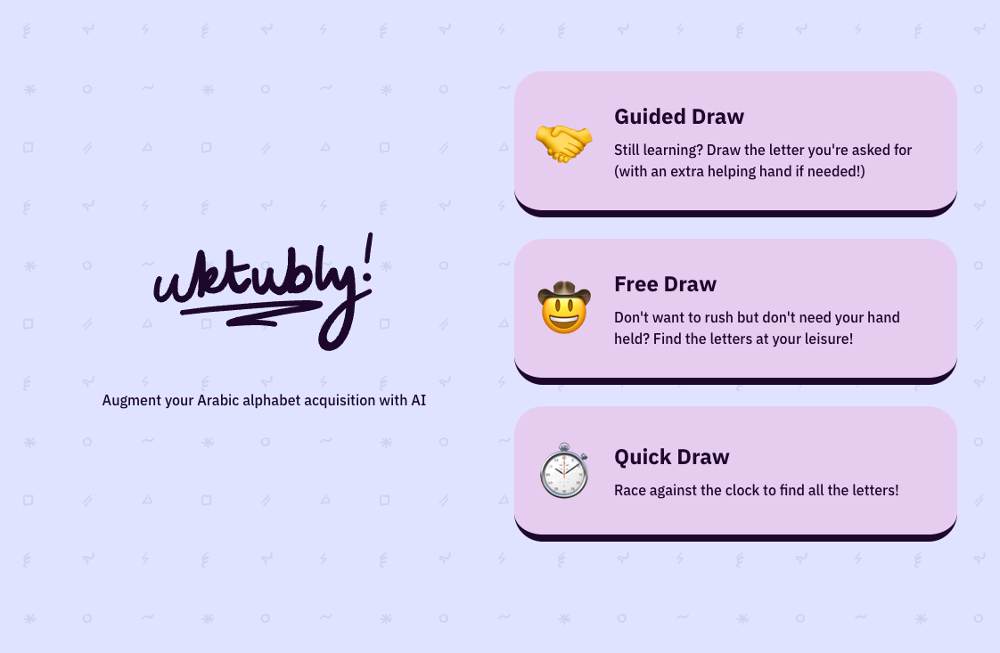
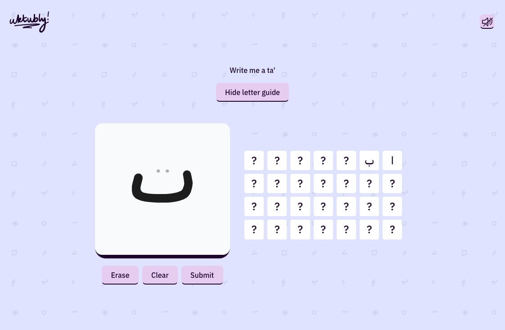

# Uktubly

|                                          |                                                      |
| ---------------------------------------- | ---------------------------------------------------- |
|  |  |

Uktubly is a web app for practicing writing Arabic letters. Its purpose is for me to gain hands-on experience with building models designed for practical Arabic handwriting recognition tasks and integrating them into a usable product, while also providing a fun tool to help friends and family with language learning.

Why's it called "Uktubly"? That's a sound-alike for "write for me" in Arabic. :)

## Codebase

The codebase is split into two parts:

The `/ml` folder contains a script for building and training a CNN implemented with the tfjs-node library. It is trained on a dataset provided by [Dr Mohamed Loey on Kaggle](https://www.kaggle.com/datasets/mloey1/ahcd1/data). It is a relatively simple model designed to be run on a local machine and isn't very resource-intensive. For reference, the training completes within about 10 minutes on a M1 Macbook Air when the number of epochs is set to 20, but that number can be reduced to about half without much effect.

To run the model training script:
`cd ml && pnpm i && pnpm train`

Note that this doesn't automatically include it in the frontend. There's also a convenience script in the root directory, `build-model.sh`, which builds the model and copies the output into the frontend app's public folder.

The `/frontend` folder contains the main React app, which contains a minimal tldraw canvas where the user can draw a letter. The app will try to identify it using the pre-trained model generated by the `/ml` folder's script which runs natively in the browser, so it's very snappy.

To run the frontend:
`cd frontend && pnpm i && npm dev`

## Status

This is a work in progress! The current iteration of the model recognises most letters pretty well. At the moment the application only recognises standalone versions of letters.

### Planned features and improvements

- Addition of starting, medial and ending letter forms.
- Addition of numbers.
